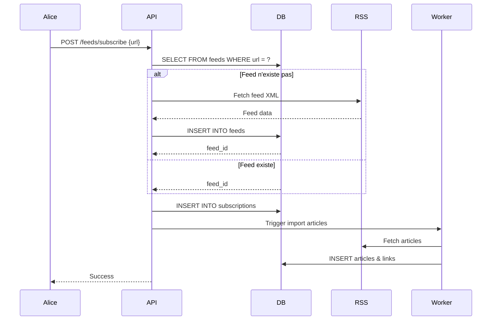

# Architecture RSS & Gestion des Articles

## 📋 Table des matières

- [Vue d'ensemble](#vue-densemble)
- [Modèle de données](#modèle-de-données)
- [Flux d'import RSS](#flux-dimport-rss)
- [Déduplication](#déduplication)
- [Requêtes SQL courantes](#requêtes-sql-courantes)
- [Processus de synchronisation](#processus-de-synchronisation)
- [Cas d'usage](#cas-dusage)

---

## Vue d'ensemble

Ce système implémente un lecteur "read-it-later" avec support natif des flux RSS/Atom. L'architecture repose sur une séparation claire entre :

- **Le contenu partagé** : Articles stockés une seule fois
- **Les données personnelles** : État de lecture et organisation par utilisateur
- **Les sources** : Flux RSS et abonnements

### Principes fondamentaux

1. **Un article = une entrée** : Le même article sauvé par 1000 utilisateurs n'est stocké qu'une fois
2. **Déduplication par hash** : Chaque URL unique a un hash pour éviter les doublons
3. **Séparation contenu/métadonnées** : Le HTML/texte est séparé de l'état de lecture
4. **RSS first-class** : Les flux RSS ne sont pas un simple add-on mais une fonctionnalité centrale

---

## Modèle de données

### Schéma relationnel


### Tables principales

#### `users`
Utilisateurs de l'application.

```sql
id           UUID PRIMARY KEY
username     TEXT UNIQUE
email        CITEXT UNIQUE
password_hash BYTEA
created_at   TIMESTAMP
updated_at   TIMESTAMP
```

#### `articles`
Contenu des articles (partagé entre tous les utilisateurs).

```sql
id                    BIGINT PRIMARY KEY
url                   TEXT NOT NULL
hash                  TEXT UNIQUE -- Hash SHA256 de l'URL
title                 TEXT
description           TEXT
author                TEXT
image_url             TEXT
page_type             TEXT -- 'article', 'video', 'pdf'
reading_time_minutes  REAL
original_html         TEXT -- HTML brut
content               TEXT -- HTML nettoyé
text_content          TEXT -- Texte seul
tsv                   TSVECTOR -- Pour recherche full-text
published_at          TIMESTAMP
created_at            TIMESTAMP
updated_at            TIMESTAMP
```

**Rôle** : Stockage unique du contenu. Un article existe indépendamment des utilisateurs.

#### `feeds`
Flux RSS/Atom disponibles dans le système.

```sql
id              BIGINT PRIMARY KEY
url             TEXT UNIQUE -- URL du flux RSS/Atom
original_title  TEXT -- Titre du feed (ex: "Le Monde - Actualités")
site_url        TEXT -- URL du site web
image_url       TEXT -- Logo/favicon du feed
last_fetched_at TIMESTAMP
is_active       BOOLEAN
created_at      TIMESTAMP
```

**Rôle** : Catalogue des flux RSS disponibles. Partagé entre utilisateurs.

#### `subscriptions`
Abonnements aux flux RSS par utilisateur.

```sql
id           BIGINT PRIMARY KEY
user_id      UUID REFERENCES users
feed_id      BIGINT REFERENCES feeds
custom_title TEXT -- Nom personnalisé (override original_title)
custom_icon  TEXT -- Emoji ou URL
category     TEXT -- "Tech", "News", "Blogs"
created_at   TIMESTAMP

UNIQUE(user_id, feed_id) -- Un user ne peut s'abonner 2× au même feed
```

**Rôle** : Relation many-to-many entre users et feeds avec personnalisation.

#### `links`
Articles sauvés par utilisateur (état personnel).

```sql
id                             BIGINT PRIMARY KEY
user_id                        UUID REFERENCES users
article_id                     BIGINT REFERENCES articles
feed_id                        BIGINT REFERENCES feeds -- Optionnel
slug                           TEXT
is_read                        BOOLEAN
is_starred                     BOOLEAN
reading_progress               REAL -- 0.0 à 1.0
reading_progress_anchor_index  INTEGER -- Paragraphe actuel
saved_at                       TIMESTAMP
archived_at                    TIMESTAMP
created_at                     TIMESTAMP
updated_at                     TIMESTAMP

UNIQUE(user_id, article_id) -- Un user ne peut sauver 2× le même article
```

**Rôle** : État de lecture et organisation personnelle de chaque article par utilisateur.

#### `labels`
Tags personnalisés par utilisateur.

```sql
id          BIGINT PRIMARY KEY
user_id     UUID REFERENCES users
name        TEXT
color       TEXT
description TEXT
position    INTEGER
created_at  TIMESTAMP

UNIQUE(user_id, name)
```

#### `link_labels`
Association many-to-many entre links et labels.

```sql
link_id    BIGINT REFERENCES links
label_id   BIGINT REFERENCES labels
created_at TIMESTAMP

PRIMARY KEY(link_id, label_id)
```

#### `highlights`
Annotations et surlignages sur les articles.

```sql
id             BIGINT PRIMARY KEY
user_id        UUID REFERENCES users
link_id        BIGINT REFERENCES links
quote          TEXT -- Texte surligné
annotation     TEXT -- Note personnelle
color          TEXT
position_start INTEGER
position_end   INTEGER
created_at     TIMESTAMP
updated_at     TIMESTAMP
```

---

## Flux d'import RSS

### 1. Ajout d'un flux RSS

#### Étape 1 : L'utilisateur soumet une URL RSS

```
User input: https://blog.example.com/feed.xml
```

#### Étape 2 : Vérification si le feed existe déjà

```sql
SELECT id, url FROM feeds WHERE url = 'https://blog.example.com/feed.xml';
```

- **Existe** → Récupérer `feed_id`
- **N'existe pas** → Passer à l'étape 3

#### Étape 3 : Fetch et parsing du flux RSS

```go
// Pseudo-code Go
resp, err := http.Get(feedURL)
feed, err := parseFeed(resp.Body) // Utiliser gofeed ou équivalent

// Extraire les métadonnées
feedData := Feed{
    URL:           feedURL,
    OriginalTitle: feed.Title,
    SiteURL:       feed.Link,
    ImageURL:      feed.Image.URL,
    LastFetchedAt: time.Now(),
}
```

#### Étape 4 : Insertion du feed

```sql
INSERT INTO feeds (url, original_title, site_url, image_url, last_fetched_at)
VALUES ($1, $2, $3, $4, NOW())
RETURNING id;
```

#### Étape 5 : Création de la subscription

```sql
INSERT INTO subscriptions (user_id, feed_id, created_at)
VALUES ($1, $2, NOW());
```

### 2. Import des articles du feed

Pour chaque `<item>` du flux RSS :

#### Étape 1 : Calculer le hash de l'URL

```go
import "crypto/sha256"

func calculateHash(url string) string {
    hash := sha256.Sum256([]byte(url))
    return hex.EncodeToString(hash[:])
}
```

#### Étape 2 : Vérifier si l'article existe déjà

```sql
SELECT id FROM articles WHERE hash = $1;
```

- **Existe** → Récupérer `article_id`, passer à l'étape 5
- **N'existe pas** → Passer à l'étape 3

#### Étape 3 : Fetch du contenu de l'article

```go
// Utiliser un parser comme go-readability
resp, err := http.Get(articleURL)
article, err := readability.FromReader(resp.Body, articleURL)

articleData := Article{
    URL:         articleURL,
    Hash:        calculateHash(articleURL),
    Title:       article.Title,
    Author:      article.Byline,
    Content:     article.Content,      // HTML nettoyé
    TextContent: article.TextContent,  // Texte brut
    ImageURL:    article.Image,
    PublishedAt: parseDate(item.PubDate),
}
```

#### Étape 4 : Insertion de l'article

```sql
INSERT INTO articles (
    url, hash, title, description, author, image_url, 
    content, text_content, published_at
)
VALUES ($1, $2, $3, $4, $5, $6, $7, $8, $9)
RETURNING id;
```

**Note** : Le trigger `calculate_reading_time()` calcule automatiquement `reading_time_minutes`.

#### Étape 5 : Vérifier si l'utilisateur a déjà ce link

```sql
SELECT id FROM links 
WHERE user_id = $1 AND article_id = $2;
```

- **Existe** → Skip (l'utilisateur l'a déjà)
- **N'existe pas** → Créer le link

#### Étape 6 : Création du link

```sql
INSERT INTO links (
    user_id, article_id, feed_id, slug, 
    saved_at, is_read, is_starred
)
VALUES ($1, $2, $3, $4, NOW(), false, false);
```

### 3. Mise à jour du feed

```sql
UPDATE feeds 
SET last_fetched_at = NOW() 
WHERE id = $1;
```

---

## Déduplication

### Principe

La déduplication s'opère à plusieurs niveaux pour garantir l'intégrité des données.

### Niveau 1 : Feeds (par URL)

```sql
-- Contrainte UNIQUE sur feeds.url
CREATE UNIQUE INDEX ON feeds(url);
```

**Résultat** : Impossible d'avoir 2 feeds avec la même URL RSS.

### Niveau 2 : Articles (par hash)

```sql
-- Contrainte UNIQUE sur articles.hash
CREATE UNIQUE INDEX ON articles(hash);
```

**Algorithme** :

```go
func getOrCreateArticle(url string) (int64, error) {
    hash := calculateHash(url)
    
    // Tenter de récupérer l'article existant
    var articleID int64
    err := db.QueryRow(
        "SELECT id FROM articles WHERE hash = $1", 
        hash,
    ).Scan(&articleID)
    
    if err == sql.ErrNoRows {
        // Article n'existe pas : le créer
        articleID, err = fetchAndInsertArticle(url, hash)
    }
    
    return articleID, err
}
```

**Résultat** : Chaque URL unique = 1 seul article dans la base.

### Niveau 3 : Links (par user + article)

```sql
-- Contrainte UNIQUE sur (user_id, article_id)
CREATE UNIQUE INDEX ON links(user_id, article_id);
```

**Résultat** : Un utilisateur ne peut pas sauver 2× le même article.

### Niveau 4 : Subscriptions (par user + feed)

```sql
-- Contrainte UNIQUE sur (user_id, feed_id)
CREATE UNIQUE INDEX ON subscriptions(user_id, feed_id);
```

**Résultat** : Un utilisateur ne peut pas s'abonner 2× au même feed.

---

## Requêtes SQL courantes

### Récupérer les articles non-lus d'un utilisateur

```sql
SELECT 
    a.id,
    a.title,
    a.author,
    a.image_url,
    a.reading_time_minutes,
    l.saved_at,
    l.reading_progress,
    f.original_title AS feed_title
FROM links l
JOIN articles a ON l.article_id = a.id
LEFT JOIN feeds f ON l.feed_id = f.id
WHERE l.user_id = $1
  AND l.is_read = false
  AND l.archived_at IS NULL
ORDER BY l.saved_at DESC
LIMIT 50;
```

### Récupérer les articles d'un feed spécifique

```sql
SELECT 
    a.id,
    a.title,
    a.description,
    l.is_read,
    l.saved_at
FROM links l
JOIN articles a ON l.article_id = a.id
WHERE l.user_id = $1
  AND l.feed_id = $2
ORDER BY a.published_at DESC;
```

### Recherche full-text

```sql
SELECT 
    a.id,
    a.title,
    a.description,
    ts_rank(a.tsv, query) AS rank
FROM articles a,
     to_tsquery('french', $1) AS query
WHERE a.tsv @@ query
  AND EXISTS (
      SELECT 1 FROM links 
      WHERE article_id = a.id AND user_id = $2
  )
ORDER BY rank DESC
LIMIT 20;
```

**Exemple d'utilisation** :

```sql
-- Rechercher "intelligence artificielle"
EXECUTE search_query('intelligence & artificielle', 'user-uuid');
```

### Statistiques de lecture

```sql
-- Temps de lecture total cette semaine
SELECT 
    SUM(a.reading_time_minutes) AS total_minutes,
    COUNT(*) AS articles_read
FROM links l
JOIN articles a ON l.article_id = a.id
WHERE l.user_id = $1
  AND l.is_read = true
  AND l.updated_at >= NOW() - INTERVAL '7 days';
```

### Articles populaires (sauvés par le plus d'utilisateurs)

```sql
SELECT 
    a.id,
    a.title,
    a.url,
    COUNT(l.id) AS save_count
FROM articles a
JOIN links l ON l.article_id = a.id
WHERE l.saved_at >= NOW() - INTERVAL '30 days'
GROUP BY a.id
ORDER BY save_count DESC
LIMIT 10;
```

### Feeds les plus actifs d'un utilisateur

```sql
SELECT 
    f.id,
    COALESCE(s.custom_title, f.original_title) AS title,
    s.custom_icon,
    COUNT(l.id) AS article_count,
    COUNT(l.id) FILTER (WHERE l.is_read = false) AS unread_count
FROM subscriptions s
JOIN feeds f ON s.feed_id = f.id
LEFT JOIN links l ON l.feed_id = f.id AND l.user_id = s.user_id
WHERE s.user_id = $1
GROUP BY f.id, s.custom_title, f.original_title, s.custom_icon
ORDER BY article_count DESC;
```

---

## Processus de synchronisation

### Refresh automatique des feeds (Cron job)

```go
// À exécuter toutes les heures
func refreshFeeds() {
    // 1. Récupérer les feeds actifs non synchronisés récemment
    feeds := db.Query(`
        SELECT id, url 
        FROM feeds 
        WHERE is_active = true 
          AND (last_fetched_at IS NULL 
               OR last_fetched_at < NOW() - INTERVAL '1 hour')
        LIMIT 100
    `)
    
    for _, feed := range feeds {
        // 2. Fetch et parse le flux
        feedData := fetchAndParseFeed(feed.URL)
        
        // 3. Pour chaque nouvel item
        for _, item := range feedData.Items {
            hash := calculateHash(item.Link)
            
            // 4. Vérifier si l'article existe déjà
            articleID := getOrCreateArticle(item.Link, hash)
            
            // 5. Créer des links pour tous les utilisateurs abonnés
            subscribers := db.Query(`
                SELECT user_id 
                FROM subscriptions 
                WHERE feed_id = $1
            `, feed.ID)
            
            for _, userID := range subscribers {
                createLinkIfNotExists(userID, articleID, feed.ID)
            }
        }
        
        // 6. Mettre à jour la date de fetch
        db.Exec(`
            UPDATE feeds 
            SET last_fetched_at = NOW() 
            WHERE id = $1
        `, feed.ID)
    }
}
```

### Stratégie de refresh

| Type de feed | Fréquence | Raison |
|--------------|-----------|--------|
| News (Breaking) | 15 min | Actualité rapide |
| Blogs Tech | 1 heure | Publications régulières |
| Blogs perso | 6 heures | Publications espacées |
| Podcasts | 24 heures | Épisodes hebdomadaires |

**Optimisation** : Adapter la fréquence selon l'activité réelle du feed.

---

## Cas d'usage

### Cas 1 : Alice s'abonne à un nouveau feed



**Résultat** : Alice voit immédiatement le feed, les articles arrivent progressivement.

### Cas 2 : Bob sauve le même article qu'Alice

```
1. Alice sauve https://blog.com/article-x
   → articles.id = 1 (nouveau)
   → links.id = 100 (Alice)

2. Bob sauve https://blog.com/article-x
   → articles.id = 1 (existant, détecté via hash)
   → links.id = 101 (Bob)
```

**Économie** : 1 seul article en DB au lieu de 2.

### Cas 3 : Alice et Bob s'abonnent au même feed

```
1. Alice s'abonne à "TechCrunch"
   → feeds.id = 5 (nouveau)
   → subscriptions.id = 10 (Alice + feed 5)

2. Bob s'abonne à "TechCrunch"
   → feeds.id = 5 (existant)
   → subscriptions.id = 11 (Bob + feed 5)

3. Nouvel article publié sur TechCrunch
   → articles.id = 200 (nouveau)
   → links.id = 500 (Alice + article 200)
   → links.id = 501 (Bob + article 200)
```

**Résultat** : 1 feed, 1 article, 2 links (un par utilisateur).

### Cas 4 : Alice personnalise son feed

```sql
-- Alice renomme "TechCrunch" en "TC" avec un emoji
UPDATE subscriptions
SET custom_title = 'TC',
    custom_icon = '🚀',
    category = 'Tech'
WHERE user_id = 'alice-uuid' AND feed_id = 5;
```

**Résultat** : 
- Alice voit "🚀 TC" dans sa sidebar
- Bob voit toujours "TechCrunch" (original_title)

### Cas 5 : Recherche d'articles

```sql
-- Alice cherche "kubernetes docker"
SELECT a.id, a.title
FROM articles a
JOIN links l ON l.article_id = a.id
WHERE l.user_id = 'alice-uuid'
  AND a.tsv @@ to_tsquery('french', 'kubernetes & docker')
ORDER BY ts_rank(a.tsv, to_tsquery('french', 'kubernetes & docker')) DESC;
```

**Note** : Seuls les articles sauvés par Alice sont recherchés (via JOIN links).

---

## Bonnes pratiques

### Performance

1. **Limiter le fetch initial** : N'importer que les 20 derniers articles d'un nouveau feed
2. **Index sur hash** : Permet une recherche O(1) pour la déduplication
3. **Pagination** : Toujours paginer les requêtes d'articles (LIMIT + OFFSET)
4. **Cache Redis** : Mettre en cache les feeds populaires

### Gestion des erreurs

```go
// Exemple de gestion d'erreur lors du fetch
func fetchAndInsertArticle(url, hash string) (int64, error) {
    resp, err := http.Get(url)
    if err != nil {
        // Log mais ne pas bloquer (article inaccessible)
        log.Printf("Failed to fetch %s: %v", url, err)
        return 0, ErrArticleUnavailable
    }
    
    article, err := parseArticle(resp.Body)
    if err != nil {
        // Parser a échoué (HTML invalide)
        log.Printf("Failed to parse %s: %v", url, err)
        return 0, ErrParsingFailed
    }
    
    // Insertion avec retry en cas de conflit
    return insertArticleWithRetry(article)
}
```

### Sécurité

1. **Validation des URLs** : Vérifier que l'URL est bien un feed RSS/Atom
2. **Rate limiting** : Limiter le nombre de feeds ajoutés par utilisateur/jour
3. **Sanitization** : Nettoyer le HTML avant stockage (protection XSS)
4. **Timeout** : Limiter le temps de fetch à 10 secondes

### Maintenance

```sql
-- Nettoyer les articles orphelins (aucun link)
DELETE FROM articles
WHERE id NOT IN (SELECT DISTINCT article_id FROM links)
  AND created_at < NOW() - INTERVAL '90 days';

-- Désactiver les feeds inactifs
UPDATE feeds
SET is_active = false
WHERE last_fetched_at < NOW() - INTERVAL '30 days'
  AND id NOT IN (
      SELECT feed_id FROM subscriptions
  );
```

---

## Glossaire

| Terme | Définition |
|-------|------------|
| **Feed** | Flux RSS/Atom (source d'articles) |
| **Subscription** | Abonnement d'un utilisateur à un feed |
| **Article** | Contenu d'un article (partagé) |
| **Link** | Relation entre un user et un article (personnel) |
| **Hash** | Empreinte SHA256 de l'URL pour déduplication |
| **Slug** | Identifiant court pour URLs (ex: `/a/abc123`) |
| **TSV** | Text Search Vector (index full-text PostgreSQL) |

---

## Évolutions futures

### Phase 1 (MVP)
- ✅ Import RSS basique
- ✅ Déduplication
- ✅ Recherche full-text
- ✅ Labels et highlights

### Phase 2
- 📧 Newsletters par email (forward to save)
- 🔔 Notifications push (nouveaux articles)
- 📱 Apps mobiles natives
- 🎨 Personnalisation avancée (thèmes, polices)

### Phase 3
- 🤖 Résumés IA des articles
- 🔗 Partage public de collections
- 📊 Analytics de lecture
- 🌐 Support multi-langues

---

## Support

Pour toute question sur l'architecture :
- 📖 Lire cette documentation
- 🐛 Ouvrir une issue GitHub
- 💬 Rejoindre le Discord du projet

**Auteur** : [Votre nom]  
**Dernière mise à jour** : Janvier 2025  
**Version** : 1.0.0

[![](https://mermaid.ink/img/pako:eNp1Vdly4jgU_RWV56FfnHRYA9R0TzlAOiQECEsnHUNRii2DJl4YLalkTP6lH4fv4MdGlgyWUt15SKF77zn36C5yanmJj6yWtSJwswbTzjwG4s9xZwyHmEKGOAE04RFiYDbug_FksgAnJ1_BRZod_f3u7_1P4MOYggAhn_71rgjU_4ssdDtI4i1ou5eIeWvwcCtQXAYv9KAhx1vQccf7ncc3-x1BRMYssQ_QK6YMxmyhU7elim6qWIc3h8RdydYlRAjfgkt3jFjCSSzokLT9-UQ-f-3FLzAUzOI2n8l-RxHkCx0-vNmCb-4IEipwmeIs0GFJZEj4JiVcpTJOk3BlStCNGXHP7b4yAjFBINrvGPSTON7vEJXKGGYhsgHFDC05CW2AI7iSP43UPZn62u0NJt3xFPQG06GqvySRwITgFY5huPxIKUOOtDYIIWXLICujKDc0q3wt89y4wyeGYnxsSR7TUV4dcCNNfUMY5U_UI3jDcBLnAkVdBY194FOaPE5FiZXeL4NZv2-YsZfE0moI7Mt8t2kv2iSEiW5BwrAX5tXMB80cyttiKAfaeFDuefv_FE5XDDwxIaI_Cx0tp3XojgQWeGv4D0dAlDfKJjvbED3dUCocuW0YejwUidaQrpU6BMJP2Rblmg3YSMLu0isRrTYAKVC2aodLmhe7K6SNjUXKw0WhJcWHfbor6jHJl1SUWvSbFyp_pXAiFU5TOc2eLFWxA1NjB2ZuP1npC5glwDHPtL0gT9QevxSCpsdV-e4OEGPJm4i7mt72JfS4PAy9sqVSag7tdyns3phBYyzk2GdtsIFajqMmQWUbxDYQBTk16O8l_cNxJ4rq5mFjFaBjHqTpR9rH8bPezU02QNk2mJ38UXTy0Z08443qhHpsKeQv-91Cj5TNcxzjxqFI9WHbCqXqxoftAzTkq1_c1HGkbOcidTgjiMoZPw7dY-5Up5lxyvHa0z40TEpw252NOs60qz1dk-7044P0ZTC8N2Wpt3-g2yh7CxFwQIDDsPUHKgW1INA9l7knCDzfL-ueQe7xGqjuNXXP9RETNL2q7un_1nP_W4_jGC7LFp9c7FstRjiyrQiRCGZHK81Ac4utUYTmVkv89CF5nlvz-F1gNjB-TJLoACMJX62tVgBDKk5844sPdgdD8TEvQlDsI9JOeMysVqlerkgSq5Var1arWq2cNqu181qjVK9XGrWabb1ZrZNS46x62qyVzxv1ZvOsWanU323rX5m3clpqNEq1erlWbpxVzkvl9_8Be4GelQ?type=png)](https://mermaid.live/edit#pako:eNp1Vdly4jgU_RWV56FfnHRYA9R0TzlAOiQECEsnHUNRii2DJl4YLalkTP6lH4fv4MdGlgyWUt15SKF77zn36C5yanmJj6yWtSJwswbTzjwG4s9xZwyHmEKGOAE04RFiYDbug_FksgAnJ1_BRZod_f3u7_1P4MOYggAhn_71rgjU_4ssdDtI4i1ou5eIeWvwcCtQXAYv9KAhx1vQccf7ncc3-x1BRMYssQ_QK6YMxmyhU7elim6qWIc3h8RdydYlRAjfgkt3jFjCSSzokLT9-UQ-f-3FLzAUzOI2n8l-RxHkCx0-vNmCb-4IEipwmeIs0GFJZEj4JiVcpTJOk3BlStCNGXHP7b4yAjFBINrvGPSTON7vEJXKGGYhsgHFDC05CW2AI7iSP43UPZn62u0NJt3xFPQG06GqvySRwITgFY5huPxIKUOOtDYIIWXLICujKDc0q3wt89y4wyeGYnxsSR7TUV4dcCNNfUMY5U_UI3jDcBLnAkVdBY194FOaPE5FiZXeL4NZv2-YsZfE0moI7Mt8t2kv2iSEiW5BwrAX5tXMB80cyttiKAfaeFDuefv_FE5XDDwxIaI_Cx0tp3XojgQWeGv4D0dAlDfKJjvbED3dUCocuW0YejwUidaQrpU6BMJP2Rblmg3YSMLu0isRrTYAKVC2aodLmhe7K6SNjUXKw0WhJcWHfbor6jHJl1SUWvSbFyp_pXAiFU5TOc2eLFWxA1NjB2ZuP1npC5glwDHPtL0gT9QevxSCpsdV-e4OEGPJm4i7mt72JfS4PAy9sqVSag7tdyns3phBYyzk2GdtsIFajqMmQWUbxDYQBTk16O8l_cNxJ4rq5mFjFaBjHqTpR9rH8bPezU02QNk2mJ38UXTy0Z08443qhHpsKeQv-91Cj5TNcxzjxqFI9WHbCqXqxoftAzTkq1_c1HGkbOcidTgjiMoZPw7dY-5Up5lxyvHa0z40TEpw252NOs60qz1dk-7044P0ZTC8N2Wpt3-g2yh7CxFwQIDDsPUHKgW1INA9l7knCDzfL-ueQe7xGqjuNXXP9RETNL2q7un_1nP_W4_jGC7LFp9c7FstRjiyrQiRCGZHK81Ac4utUYTmVkv89CF5nlvz-F1gNjB-TJLoACMJX62tVgBDKk5844sPdgdD8TEvQlDsI9JOeMysVqlerkgSq5Var1arWq2cNqu181qjVK9XGrWabb1ZrZNS46x62qyVzxv1ZvOsWanU323rX5m3clpqNEq1erlWbpxVzkvl9_8Be4GelQ)